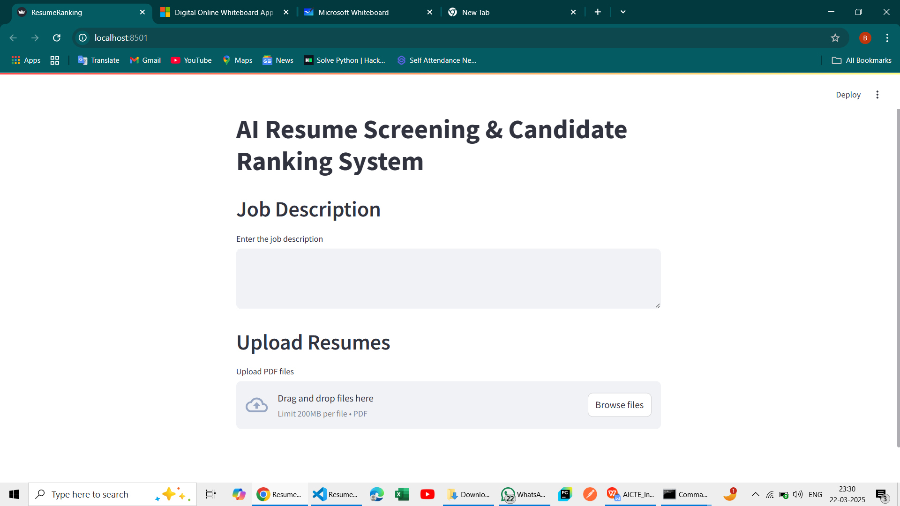
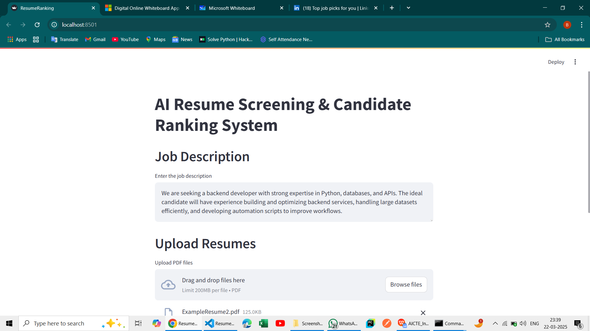
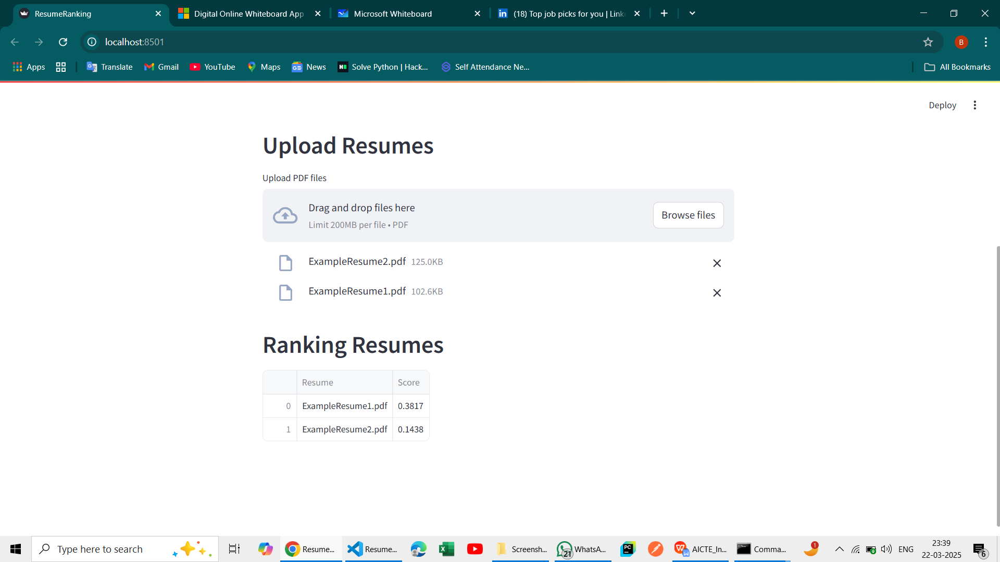

# AI-Powered Resume Screening and Ranking System

## Overview
This project is an AI-powered resume screening and ranking system that extracts text from PDF resumes, compares them with job descriptions using **TF-IDF Vectorization** and **cosine similarity**, and ranks resumes based on relevance scores. The system is implemented using **Streamlit**.

## Features
- Upload and process multiple PDF resumes.
- Extract text using **PyPDF2**.
- Vectorize resumes and job descriptions using **TF-IDF**.
- Compute similarity scores using **cosine similarity**.
- Display ranked resumes based on relevance.

## Screenshots
### *1. Home Page*


### *2. Enter Job Description & Uploading Resumes*


### *3. Ranked Resumes*


## Tech Stack
- **Backend:** Python
- **Frontend:** Streamlit
- **Libraries:**
  - `PyPDF2` (PDF text extraction)
  - `scikit-learn` (TF-IDF and cosine similarity)
  - `pandas` (data handling)
  - `streamlit` (UI framework)

## Installation

### Step 1: Clone the Repository
```
git clone <repository_link>
cd AI_Resume_Ranking
```

### Step 2: Create a Virtual Environment (Optional but Recommended)
```
python -m venv venv
source venv/bin/activate  # On macOS/Linux
venv\Scripts\activate  # On Windows
```

### Step 3: Install Dependencies
If you have `requirements.txt`, run:
```
pip install -r requirements.txt
```

If not, manually install dependencies:
```
pip install PyPDF2 scikit-learn pandas streamlit
```


## Usage
1. Run the Streamlit app:
  ```
   streamlit run app.py
   ```

2. Enter a job description and Upload resumes.
3. View ranked resumes based on relevance.

## Demo 
Here’s a glimpse of the application in action:

▶ [Click here to watch the demo video](https://drive.google.com/file/d/1g79F9WblsCFzwHGB7w-nfxU0w2b013cr/view?usp=drivesdk)

## Author
- Developed by **Priyanka Balla**.
